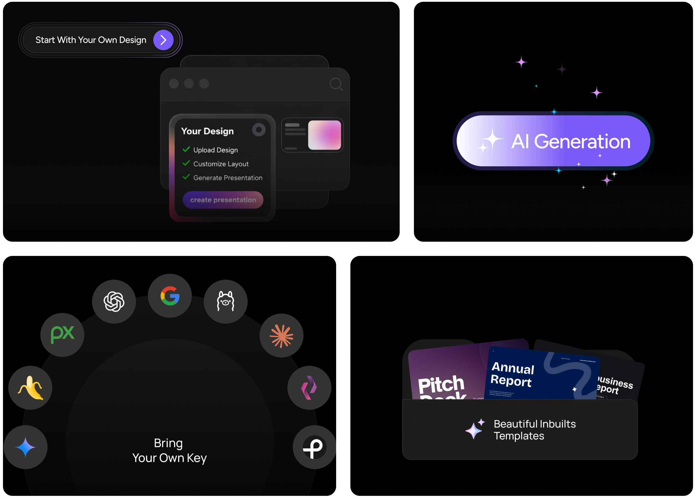

<p align="center">
  
</p>

<p align="center">
  <a href="https://presenton.ai/download"><strong>快速上手</strong></a> &middot;
  <a href="https://docs.presenton.ai/"><strong>文档</strong></a> &middot;
  <a href="https://www.youtube.com/@presentonai"><strong>Youtube</strong></a> &middot;
  <a href="https://discord.gg/9ZsKKxudNE"><strong>Discord</strong></a>
</p>

<p align="center">
  <a href="https://github.com/presenton/presenton/blob/main/LICENSE"></a>
  <a href="https://github.com/presenton/presenton"></a>
  <a href="https://presenton.ai/"></a>
</p>

<p align="center">
  <a href="./README.md">English</a> ·
  <strong>简体中文</strong>
</p>

# 开源 AI 演示文稿生成器与 API（Gamma、Beautiful AI、Decktopus 的开源替代方案）


### ✨ 为什么选择 Presenton

不绑定 SaaS · 不强制订阅 · 完全掌控自己的模型和数据

Presenton 有什么不一样？

- 通过 [Docker 镜像](https://docs.presenton.ai/v3/get-started/quickstart)在浏览器中完全**自托管**
- 或者下载[桌面应用](https://presenton.ai/download)（Mac、Windows、Linux）
- 兼容 OpenAI、Gemini、Vertex AI、Azure OpenAI、Amazon Bedrock、Fireworks、Together AI、Anthropic、LM Studio、Ollama，以及任何自定义模型
- 自带 AI 演示文稿生成 API
- 完全开源（Apache 2.0）
- 支持使用你自己的设计与模板
- **导出的 PPTX 可完整编辑**

> [!TIP]
> **给我们点个 Star！** 一个 ⭐ 既是支持，也是鼓励我们持续打磨的动力 😇

<p align="center">
  
</p>

#

### 🎛 功能特性

<p align="center">
  
</p>

#

### 💻 Presenton Desktop

使用你自己的模型服务商（BYOK）来生成 AI 演示文稿，也可以把所有流程跑在本机上，享受完整的控制权与数据隐私。

<p align="center">
  <a href="https://presenton.ai/download">
    
  </a>
</p>

**支持的平台**

<table>
<tr>
<th align="left">平台</th>
<th align="left">架构</th>
<th align="left">安装包</th>
<th align="left">下载</th>
</tr>

<tr>
<td><b>macOS</b></td>
<td>Apple Silicon / Intel</td>
<td><code>.dmg</code></td>
<td><a href="https://presenton.ai/download">下载 ↗</a></td>
</tr>

<tr>
<td><b>Windows</b></td>
<td>x64</td>
<td><code>.exe</code></td>
<td><a href="https://presenton.ai/download">下载 ↗</a></td>
</tr>

<tr>
<td><b>Linux</b></td>
<td>x64</td>
<td> <code>.deb</code></td>
<td><a href="https://presenton.ai/download">下载 ↗</a></td>
</tr>

</table>


**一键部署到云平台**

<div style="display:flex; gap:12px; align-items:center;">
  <a href="https://railway.com/deploy/presenton-ai-presentations">
    
  </a>
  <a href="https://cloud.digitalocean.com/apps/new?repo=https://github.com/presenton/presenton/tree/main">
    
  </a>
</div>

#

Presenton 让你完整掌控自己的 AI 演示文稿工作流：自由选择模型、自定义体验、数据始终保留在自己手里。

- 自定义模板与主题 —— 用 HTML 和 Tailwind CSS 制作不限数量的演示设计
- AI 模板生成 —— 基于已有的 PowerPoint 文件生成演示模板
- 灵活的生成方式 —— 既可以从提示词出发，也可以基于上传的文档生成
- 导出即用 —— 导出为格式规范的 PowerPoint（PPTX）和 PDF
- 内置 MCP Server —— 通过 Model Context Protocol 生成演示文稿
- BYOK（自带密钥） —— 使用你自己在 OpenAI、Google Gemini、Vertex AI、Azure OpenAI、Anthropic Claude 等服务商的密钥，按量付费，无隐藏费用，无订阅
- Ollama 集成 —— 在本地运行开源模型，隐私无忧
- 兼容 OpenAI API —— 可接入任何 OpenAI 兼容的端点
- 多服务商支持 —— 文本与图像生成可以分别配置不同的服务商
- 多样的图像生成 —— DALL-E 3、Gemini Flash、Pexels、Pixabay 任你挑选
- 丰富的多媒体支持 —— 图标、图表、自定义图形，做出专业感十足的演示
- 本地运行 —— 全部处理都在你的设备上完成，无需依赖云端
- API 部署 —— 把 Presenton 当作团队内部的 API 服务来托管
- 完全开源 —— Apache 2.0 协议，可自由审阅、修改、贡献
- Docker 就绪 —— 一行命令完成部署，并支持 GPU 用于本地模型
- Electron 桌面应用 —— 在 Windows、macOS、Linux 上以原生应用方式运行，无需浏览器
- 使用 ChatGPT 登录 —— 直接用免费或付费 ChatGPT 账号登录，无需另外配置 API Key 即可开始生成演示

#

### ☁️ Presenton Cloud

直接在浏览器中使用 Presenton —— 无需安装、无需配置，随时随地开始创作。

<p align="center">
  <a href="https://presenton.ai">
    
  </a>
</p>

#

### ⚡ 运行 Presenton

  <p>
    Presenton 有两种运行方式：
    使用 <strong>Docker</strong> 一行命令拉起，无需搭建本地开发环境；
    或者使用 <strong>Electron 桌面应用</strong>，获得原生应用体验
    （适合开发或离线使用）。
  </p>

**方案一：Electron 桌面应用**

   <p>
    将 Presenton 作为原生桌面应用运行。LLM 与图像服务商
    （API Key 等）可在应用内配置。Docker 部署所使用的环境变量，
    在桌面端运行内置后端时同样适用。
  </p>

  <p>
    <strong>环境要求：</strong>Node.js（LTS）、npm、Python 3.11，以及
    <a href="https://docs.astral.sh/uv/">uv</a>
    （用于 <code>servers/fastapi</code> 中共享的 FastAPI 后端）。
  </p>

- 初次设置
  <pre><code class="language-bash">cd electron
  npm run setup:env</code></pre>

  这一步会安装 Node 依赖，在 FastAPI 服务目录下执行 <code>uv sync</code>，
  并安装 Next.js 依赖。

- 启动开发模式
  <pre><code class="language-bash">npm run dev</code></pre>
  <p>
  会编译 TypeScript 并启动 Electron。后端与界面都在本地的桌面窗口中运行。
  </p>

- 构建可分发版本（可选）
  生成 Windows、macOS 或 Linux 的安装包：
  <pre><code class="language-bash">npm run build:all
  npm run dist</code></pre>
  <p>
  产物会输出到 <code>electron/dist</code>
  （或按你在 <code>electron-builder</code> 中的配置）。
  </p>

**方案二：Docker**

- 启动 Presenton
  Linux/MacOS（Bash/Zsh）：
  <pre><code class="language-bash">docker run -it --name presenton -p 5000:80 -v "./app_data:/app_data" ghcr.io/presenton/presenton:latest</code></pre>

  Windows（PowerShell）：
  <pre><code class="language-bash">docker run -it --name presenton -p 5000:80 -v "${PWD}\app_data:/app_data" ghcr.io/presenton/presenton:latest</code></pre>

- 打开 Presenton
  <p>
  在浏览器中访问 <a href="http://localhost:5000">http://localhost:5000</a>
  即可开始使用。
  </p>

  <blockquote>
  <p>
    <strong>提示：</strong>可以把 <code>5000</code> 替换成任意其他端口，
    让 Presenton 监听在另一个端口上。
  </p>
  </blockquote>

#

### ⚙️ 部署配置

下面的列表与本仓库 **`docker-compose.yml`** 中各服务（`production`、`production-gpu`、`development`、`development-gpu`）转发的环境变量一一对应。可以把值写在 `docker-compose.yml` 旁边的 `.env` 中，或者在执行 `docker compose up` 前导出。Electron 桌面端在 Docker 之外运行时，后端也能读取同名的变量。

代码中还存在一些其他可选变量（例如 Mem0 的高级路径、LiteParse runners，或者 Next.js 与 FastAPI 不同源时使用的 `FAST_API_INTERNAL_URL`），它们**没有**在 `docker-compose.yml` 中接好。完整支持的变量名可以在 `servers/fastapi/utils/get_env.py` 以及 `servers/nextjs/` 下的 Next.js 服务工具中查到。

#### LLM 与 API Key

- **CAN_CHANGE_KEYS**=[true/false]：设为 **false** 后可隐藏 API Key 并禁止修改。
- **LLM**=[openai/google/vertex/azure/anthropic/lmstudio/ollama/custom/codex]：选择文本 **LLM**。
- **OPENAI_API_KEY**：当 **LLM** 为 **openai** 时必填。
- **OPENAI_MODEL**：当 **LLM** 为 **openai** 时必填（默认：`gpt-4.1`）。
- **GOOGLE_API_KEY**：当 **LLM** 为 **google** 时必填。
- **GOOGLE_MODEL**：当 **LLM** 为 **google** 时必填（默认：`models/gemini-2.0-flash`）。
- **VERTEX_MODEL**：当 **LLM** 为 **vertex** 时必填（默认:`gemini-2.5-flash`）。
- **VERTEX_API_KEY**：**LLM=vertex** 时的可选认证方式（Vertex Express）。
- **VERTEX_PROJECT** / **VERTEX_LOCATION**：**LLM=vertex** 且使用 GCP 项目凭证时的可选认证方式（不要与 `VERTEX_API_KEY` 同时使用）。
- **VERTEX_BASE_URL**：可选的 Vertex 网关/基础 URL 覆盖。
- **AZURE_OPENAI_MODEL**：当 **LLM** 为 **azure** 时必填（deployment/model 名称）。
- **AZURE_OPENAI_API_KEY**：当 **LLM** 为 **azure** 时必填。
- **AZURE_OPENAI_API_VERSION**：当 **LLM** 为 **azure** 时必填（例如 `2024-10-21`）。
- **AZURE_OPENAI_ENDPOINT** / **AZURE_OPENAI_BASE_URL**：当 **LLM** 为 **azure** 时至少需要填一个。
- **AZURE_OPENAI_DEPLOYMENT**：**LLM** 为 **azure** 时的可选 deployment 覆盖。
- **BEDROCK_REGION**：**LLM** 为 **bedrock** 时可选（默认：`us-east-1`）。
- **BEDROCK_MODEL**：当 **LLM** 为 **bedrock** 时必填（示例：`us.anthropic.claude-3-5-haiku-20241022-v1:0`）。
- **BEDROCK_API_KEY**：**LLM** 为 **bedrock** 时可选（API Key 鉴权模式）。
- **BEDROCK_AWS_ACCESS_KEY_ID** / **BEDROCK_AWS_SECRET_ACCESS_KEY**：**LLM** 为 **bedrock** 时可选（AWS Key 鉴权模式；在未设置 `BEDROCK_API_KEY` 时一起使用）。
- **BEDROCK_AWS_SESSION_TOKEN**：**LLM** 为 **bedrock** 时的可选 session token。
- **BEDROCK_PROFILE_NAME**：**LLM** 为 **bedrock** 时的可选 AWS profile 名称。
- **FIREWORKS_API_KEY**：当 **LLM** 为 **fireworks** 时必填。
- **FIREWORKS_MODEL**：当 **LLM** 为 **fireworks** 时必填（示例：`accounts/fireworks/models/llama-v3p1-8b-instruct`）。
- **FIREWORKS_BASE_URL**：**LLM** 为 **fireworks** 时可选（默认：`https://api.fireworks.ai/inference/v1`）。
- **TOGETHER_API_KEY**：当 **LLM** 为 **together** 时必填。
- **TOGETHER_MODEL**：当 **LLM** 为 **together** 时必填（示例：`openai/gpt-oss-20b`）。
- **TOGETHER_BASE_URL**：**LLM** 为 **together** 时可选（默认：`https://api.together.ai/v1`）。
- **ANTHROPIC_API_KEY**：当 **LLM** 为 **anthropic** 时必填。
- **ANTHROPIC_MODEL**：当 **LLM** 为 **anthropic** 时必填（默认：`claude-3-5-sonnet-20241022`）。
- **CODEX_MODEL**：当 **LLM** 为 **codex** 时必填（Codex OAuth 流程；compose 会把宿主机端口 **1455** 映射给回调使用）。
- **CUSTOM_LLM_URL**：**LLM** 为 **custom** 时的 OpenAI 兼容 base URL。
- **CUSTOM_LLM_API_KEY**：**LLM** 为 **custom** 时的 API Key。
- **CUSTOM_MODEL**：**LLM** 为 **custom** 时的模型 id。
- **LMSTUDIO_BASE_URL**：**LLM** 为 **lmstudio** 时可选的 LM Studio base URL（默认：`http://localhost:1234/v1`；省略时会自动追加 `/v1`）。
- **LMSTUDIO_API_KEY**：**LLM** 为 **lmstudio** 时可选的 API Key。
- **LMSTUDIO_MODEL**：当 **LLM** 为 **lmstudio** 时必填（示例：`openai/gpt-oss-20b`）。
- **DISABLE_THINKING**=[true/false]：设为 **true** 可关闭自定义 LLM 的"thinking"过程。
- **WEB_GROUNDING**=[true/false]：设为 **true** 可为 OpenAI、Google、Anthropic 模型启用联网搜索。
- **EXTENDED_REASONING**=[true/false]：在所配置的模型支持的情况下启用扩展推理。

#### Ollama

当 **LLM** 为 **ollama** 时使用：

- **OLLAMA_URL**：Ollama HTTP API 的 base URL（例如从 Docker 内访问时 `http://host.docker.internal:11434`）。
- **OLLAMA_MODEL**：Ollama 中的模型名（例如 `llama3.2:3b`）。
- **START_OLLAMA**=[true/false]：容器入口（`start.js`）行为：是否在启动时安装 + 运行 `ollama serve`。默认 **false**（`development` / `production` compose）。

#### 演示文稿记忆（Mem0 OSS）

Mem0 使用本地 Qdrant + SQLite（OSS）；记忆按演示文稿隔离。

默认情况下 Docker 镜像会让 Mem0 指向一个本地 Ollama 兼容的 LLM 端点，因此初始化时不再需要 OpenAI Key。若你希望改用 OpenAI，请把 `MEM0_LLM_BASE_URL`/`MEM0_LLM_API_KEY` 设为 OpenAI 兼容的端点与 Key。
镜像在构建时会预装默认 spaCy 模型（`en_core_web_sm`），这样 Mem0 每次启动都不需要额外安装。

| 变量                         | 用途                                                                                                              |
| ---------------------------- | ----------------------------------------------------------------------------------------------------------------- |
| **MEM0_ENABLED**             | **true**/false（compose 默认 **true**）。                                                                         |
| **MEM0_LLM_MODEL**           | Mem0 LLM 模型名（compose 默认 **`llama3.1:latest`**，或取自 `OLLAMA_MODEL`）。                                    |
| **MEM0_LLM_API_KEY**         | 给 OpenAI 兼容客户端用的 Mem0 LLM API Key 占位（compose 默认 **`ollama`**）。                                      |
| **MEM0_LLM_BASE_URL**        | Mem0 LLM base URL（compose 默认 **`OLLAMA_URL`** 或 `http://host.docker.internal:11434`）。                       |
| **MEM0_DIR**                 | 根目录（compose 默认 **`/app_data/mem0`**）。                                                                     |
| **MEM0_EMBEDDER_PROVIDER**   | Embedding 后端（compose 默认 **`fastembed`**）。                                                                  |
| **MEM0_EMBEDDER_MODEL**      | 模型 id（compose 默认 **`BAAI/bge-small-en-v1.5`**）。                                                            |
| **MEM0_EMBEDDING_DIMS**      | 向量维度（compose 默认 **384**）。                                                                                |
| **MEM0_SPACY_MODEL**         | 可选的 spaCy 模型覆盖（默认 **`en_core_web_sm`**）。                                                              |
| **MEM0_REQUIRE_SPACY_MODEL** | 建议保留为 **true**（默认值）。仅当你确实希望 Mem0 在没有 spaCy 词形还原的情况下运行时，才将其设为 false。        |

#### 文档解析（LiteParse）

| 变量                      | 用途                                      |
| ------------------------- | ----------------------------------------- |
| **LITEPARSE_DPI**         | OCR 渲染 DPI（compose 默认 **120**）。    |
| **LITEPARSE_NUM_WORKERS** | Worker 数量（compose 默认 **1**）。       |

#### 数据库

- **DATABASE_URL**：SQLAlchemy 连接串；若未设置，应用会回退到 app_data 下的 SQLite。
- **MIGRATE_DATABASE_ON_STARTUP**：compose 对所有服务都设为 **`true`**，启动时自动跑迁移。

#### 图像生成

下列变量与 `docker-compose.yml` 中一致。**`IMAGE_PROVIDER`** 用于选择后端（`pexels`、`pixabay`、`gemini_flash`、`nanobanana_pro`、`dall-e-3`、`gpt-image-1.5`、`comfyui`、`open_webui`）。OpenAI 的图像模式复用 **OPENAI_API_KEY**，Gemini 的图像模式复用 **GOOGLE_API_KEY**（与上文 LLM 部分使用的 Key 相同）。

- **DISABLE_IMAGE_GENERATION**=[true/false]：关闭幻灯片图像生成。
- **IMAGE_PROVIDER**：服务商 id（参见上方枚举）。
- **PEXELS_API_KEY**：Pexels 图库。
- **PIXABAY_API_KEY**：Pixabay 图库。
- **DALL_E_3_QUALITY**=[standard/hd]：**dall-e-3** 的可选参数（默认 `standard`）。
- **GPT_IMAGE_1_5_QUALITY**=[low/medium/high]：**gpt-image-1.5** 的可选参数（默认 `medium`）。
- **COMFYUI_URL** / **COMFYUI_WORKFLOW**：自托管的 ComfyUI workflow JSON。
- **OPEN_WEBUI_IMAGE_URL** / **OPEN_WEBUI_IMAGE_API_KEY**：Open WebUI 兼容的图像端点。
- **OPENAI_COMPAT_IMAGE_BASE_URL** / **OPENAI_COMPAT_IMAGE_API_KEY** / **OPENAI_COMPAT_IMAGE_MODEL**：使用 **openai_compatible** 时必填，可将图像请求发送到任何 OpenAI 兼容的 `/v1/images/*` 端点（LiteLLM、Azure、vLLM Gateway 等）。

#### 遥测

- **DISABLE_ANONYMOUS_TRACKING**=[true/false]：设为 **true** 关闭匿名遥测。

#### 鉴权（Web 登录）

Presenton 每个实例使用**单个管理员账号**。凭证保存在 `app_data` 中（已哈希；参见 `userConfig.json`）。在使用 `docker run -e` 或 compose `.env` 时可传入：

- **AUTH_USERNAME** / **AUTH_PASSWORD** —— 首次启动时预置管理员账号（密码至少 6 位）。如果用户已存在则被忽略，除非同时设置了 **AUTH_OVERRIDE_FROM_ENV**。
- **AUTH_OVERRIDE_FROM_ENV**=[true/false] —— 若为 **true**，每次 FastAPI 启动时用环境变量覆盖已存的凭证，并轮换 session 签名密钥（已有的 session 会失效）。一次性轮换完成后请移除该变量。
- **RESET_AUTH**=[true/false] —— 若为 **true**，启动时清空已存凭证。仅在需要恢复访问时**启动一次**使用，之后请取消设置。

**示例**

```bash
docker run -it --name presenton -p 5000:80 -v "./app_data:/app_data" ghcr.io/presenton/presenton:latest
```

```bash
docker run -it --name presenton -p 5000:80 -e AUTH_USERNAME=admin -e AUTH_PASSWORD=changeme123 -v "./app_data:/app_data" ghcr.io/presenton/presenton:latest
```

```bash
docker run -it --name presenton -p 5000:80 -e AUTH_USERNAME=admin -e AUTH_PASSWORD=changeme123 -v "${PWD}\app_data:/app_data" ghcr.io/presenton/presenton:latest
```

```bash
docker stop presenton && docker rm presenton && docker run -it --name presenton -p 5000:80 -e AUTH_USERNAME=admin -e AUTH_PASSWORD=newcred456 -e AUTH_OVERRIDE_FROM_ENV=true -v "./app_data:/app_data" ghcr.io/presenton/presenton:latest
```

```bash
docker stop presenton && docker rm presenton && docker run -it --name presenton -p 5000:80 -e RESET_AUTH=true -v "./app_data:/app_data" ghcr.io/presenton/presenton:latest
```

```bash
docker stop presenton && docker rm presenton && docker run -it --name presenton -p 5000:80 -e AUTH_USERNAME=admin -e AUTH_PASSWORD=changeme123 -v "./app_data:/app_data" ghcr.io/presenton/presenton:latest
```

**手动重置：** 停止容器，编辑 `./app_data/userConfig.json`，删除 `AUTH_USERNAME`、`AUTH_PASSWORD_HASH`、`AUTH_SECRET_KEY`，保存后再启动。

在应用内退出登录：**Settings → Other → Sign out**。

> 注意：当 `.env` 中设置了上文的 LLM 与图像变量时，**`docker-compose.yml`** 会自动将它们转发到容器。

<br>
<br>

**按服务商划分的 Docker Run 示例**

变量与 compose 一致；直接用 `docker run` 时把 `.env` 换成 `-e` 即可。

- 使用 OpenAI
    <pre><code class="language-bash">docker run -it --name presenton -p 5000:80 -e LLM="openai" -e OPENAI_API_KEY="******" -e IMAGE_PROVIDER="dall-e-3" -e CAN_CHANGE_KEYS="false" -v "./app_data:/app_data" ghcr.io/presenton/presenton:latest</code></pre>

- 使用 Google
    <pre><code class="language-bash">docker run -it --name presenton -p 5000:80 -e LLM="google" -e GOOGLE_API_KEY="******" -e IMAGE_PROVIDER="gemini_flash" -e CAN_CHANGE_KEYS="false" -v "./app_data:/app_data" ghcr.io/presenton/presenton:latest</code></pre>

- 使用 Vertex AI（API Key 模式）
    <pre><code class="language-bash">docker run -it --name presenton -p 5000:80 -e LLM="vertex" -e VERTEX_API_KEY="******" -e VERTEX_MODEL="gemini-2.5-flash" -e IMAGE_PROVIDER="gemini_flash" -e CAN_CHANGE_KEYS="false" -v "./app_data:/app_data" ghcr.io/presenton/presenton:latest</code></pre>

- 使用 Azure OpenAI
    <pre><code class="language-bash">docker run -it --name presenton -p 5000:80 -e LLM="azure" -e AZURE_OPENAI_API_KEY="******" -e AZURE_OPENAI_MODEL="gpt-4.1" -e AZURE_OPENAI_API_VERSION="2024-10-21" -e AZURE_OPENAI_ENDPOINT="https://YOUR-RESOURCE.openai.azure.com" -e IMAGE_PROVIDER="pexels" -e PEXELS_API_KEY="******" -e CAN_CHANGE_KEYS="false" -v "./app_data:/app_data" ghcr.io/presenton/presenton:latest</code></pre>

- 使用 Amazon Bedrock（AWS Key）
    <pre><code class="language-bash">docker run -it --name presenton -p 5000:80 -e LLM="bedrock" -e BEDROCK_REGION="us-east-1" -e BEDROCK_AWS_ACCESS_KEY_ID="******" -e BEDROCK_AWS_SECRET_ACCESS_KEY="******" -e BEDROCK_MODEL="us.anthropic.claude-3-5-haiku-20241022-v1:0" -e IMAGE_PROVIDER="pexels" -e PEXELS_API_KEY="******" -e CAN_CHANGE_KEYS="false" -v "./app_data:/app_data" ghcr.io/presenton/presenton:latest</code></pre>

- 使用 Fireworks
    <pre><code class="language-bash">docker run -it --name presenton -p 5000:80 -e LLM="fireworks" -e FIREWORKS_API_KEY="******" -e FIREWORKS_MODEL="accounts/fireworks/models/llama-v3p1-8b-instruct" -e IMAGE_PROVIDER="pexels" -e PEXELS_API_KEY="******" -e CAN_CHANGE_KEYS="false" -v "./app_data:/app_data" ghcr.io/presenton/presenton:latest</code></pre>

- 使用 Together AI
    <pre><code class="language-bash">docker run -it --name presenton -p 5000:80 -e LLM="together" -e TOGETHER_API_KEY="******" -e TOGETHER_MODEL="openai/gpt-oss-20b" -e IMAGE_PROVIDER="pexels" -e PEXELS_API_KEY="******" -e CAN_CHANGE_KEYS="false" -v "./app_data:/app_data" ghcr.io/presenton/presenton:latest</code></pre>

- 使用 Ollama
    <pre><code class="language-bash">docker run -it --name presenton -p 5000:80 -e LLM="ollama" -e OLLAMA_MODEL="llama3.2:3b" -e IMAGE_PROVIDER="pexels" -e PEXELS_API_KEY="*******" -e CAN_CHANGE_KEYS="false" -v "./app_data:/app_data" ghcr.io/presenton/presenton:latest</code></pre>

- 使用 Anthropic
    <pre><code class="language-bash">docker run -it --name presenton -p 5000:80 -e LLM="anthropic" -e ANTHROPIC_API_KEY="******" -e IMAGE_PROVIDER="pexels" -e PEXELS_API_KEY="******" -e CAN_CHANGE_KEYS="false" -v "./app_data:/app_data" ghcr.io/presenton/presenton:latest</code></pre>

- 使用 LM Studio（本地）
    <pre><code class="language-bash">docker run -it --name presenton -p 5000:80 -e LLM="lmstudio" -e LMSTUDIO_BASE_URL="http://host.docker.internal:1234" -e LMSTUDIO_MODEL="openai/gpt-oss-20b" -e IMAGE_PROVIDER="pexels" -e PEXELS_API_KEY="******" -e CAN_CHANGE_KEYS="false" -v "./app_data:/app_data" ghcr.io/presenton/presenton:latest</code></pre>

- 使用 OpenAI 兼容的 LLM API
    <pre><code class="language-bash">docker run -it -p 5000:80 -e CAN_CHANGE_KEYS="false"  -e LLM="custom" -e CUSTOM_LLM_URL="http://*****" -e CUSTOM_LLM_API_KEY="*****" -e CUSTOM_MODEL="llama3.2:3b" -e IMAGE_PROVIDER="pexels" -e  PEXELS_API_KEY="********" -v "./app_data:/app_data" ghcr.io/presenton/presenton:latest</code></pre>

- 启用 GPU 运行 Presenton
  若要在 Ollama 模型上使用 GPU 加速，需要先安装并配置 NVIDIA Container Toolkit，让 Docker 容器能够访问 NVIDIA GPU。
  配置完成后，加上 `--gpus=all` 即可启用 GPU 运行 Presenton：
    <pre><code class="language-bash">docker run -it --name presenton --gpus=all -p 5000:80 -e LLM="ollama" -e OLLAMA_MODEL="llama3.2:3b" -e IMAGE_PROVIDER="pexels" -e PEXELS_API_KEY="*******" -e CAN_CHANGE_KEYS="false" -v "./app_data:/app_data" ghcr.io/presenton/presenton:latest</code></pre>

- 使用 OpenAI 兼容的图像服务商

  这会把所有幻灯片图像请求都转发到你的 OpenAI 兼容网关（LiteLLM、Azure、vLLM 等），同时保持文本 LLM 的配置独立：
    <pre><code class="language-bash">docker run -it --name presenton -p 5000:80 -e IMAGE_PROVIDER="openai_compatible" -e OPENAI_COMPAT_IMAGE_BASE_URL="https://proxy.example.com/v1" -e OPENAI_COMPAT_IMAGE_API_KEY="******" -e OPENAI_COMPAT_IMAGE_MODEL="gpt-image-1" -v "./app_data:/app_data" ghcr.io/presenton/presenton:latest</code></pre>

#

### ✨ 通过 API 生成演示文稿

**生成演示文稿**

<p>
<strong>端点：</strong> <code>/api/v1/ppt/presentation/generate</code><br>
<strong>方法：</strong> <code>POST</code><br>
<strong>Content-Type：</strong> <code>application/json</code>
</p>

<p>
<strong>认证（HTTP Basic）：</strong><br>
除 <code>/api/v1/auth/*</code> 之外的所有 <code>/api/v1/</code> 路由都需要认证。请使用你的 Presenton 管理员用户名和密码（与 Web UI 一致，或在 Docker 中预置的 <strong>AUTH_USERNAME</strong> / <strong>AUTH_PASSWORD</strong>）。使用 <code>curl</code> 时，把它们以 <code>-u USERNAME:PASSWORD</code> 的形式紧跟在 <code>-u</code> 之后 —— 这就是 HTTP Basic 认证，会自动为你设置 <code>Authorization: Basic …</code>。请将下例中的 <code>username:password</code> 替换为你的真实凭证。
</p>

**请求体**

<table>
<thead>
<tr>
<th>参数</th>
<th>类型</th>
<th>是否必填</th>
<th>说明</th>
</tr>
</thead>
<tbody>

<tr>
<td><code>content</code></td>
<td>string</td>
<td>是</td>
<td>用于生成演示文稿的主体内容。</td>
</tr>

<tr>
<td><code>slides_markdown</code></td>
<td>string[] | null</td>
<td>否</td>
<td>提供自定义的幻灯片 markdown，而不是自动生成。</td>
</tr>

<tr>
<td><code>instructions</code></td>
<td>string | null</td>
<td>否</td>
<td>额外的生成指令。</td>
</tr>

<tr>
<td><code>tone</code></td>
<td>string</td>
<td>否</td>
<td>
文字语气（默认：<code>"default"</code>）。
可选：<code>default</code>、<code>casual</code>、<code>professional</code>、
<code>funny</code>、<code>educational</code>、<code>sales_pitch</code>
</td>
</tr>

<tr>
<td><code>verbosity</code></td>
<td>string</td>
<td>否</td>
<td>
内容密度（默认：<code>"standard"</code>）。
可选：<code>concise</code>、<code>standard</code>、<code>text-heavy</code>
</td>
</tr>

<tr>
<td><code>web_search</code></td>
<td>boolean</td>
<td>否</td>
<td>是否启用联网搜索（默认：<code>false</code>）。</td>
</tr>

<tr>
<td><code>n_slides</code></td>
<td>integer</td>
<td>否</td>
<td>要生成的幻灯片数量（默认：<code>8</code>）。</td>
</tr>

<tr>
<td><code>language</code></td>
<td>string</td>
<td>否</td>
<td>演示文稿语言（默认：<code>"English"</code>）。</td>
</tr>

<tr>
<td><code>template</code></td>
<td>string</td>
<td>否</td>
<td>模板名称（默认：<code>"general"</code>）。</td>
</tr>

<tr>
<td><code>include_table_of_contents</code></td>
<td>boolean</td>
<td>否</td>
<td>是否包含目录幻灯片（默认：<code>false</code>）。</td>
</tr>

<tr>
<td><code>include_title_slide</code></td>
<td>boolean</td>
<td>否</td>
<td>是否包含标题幻灯片（默认：<code>true</code>）。</td>
</tr>

<tr>
<td><code>files</code></td>
<td>string[] | null</td>
<td>否</td>
<td>
要在生成时使用的文件。
请先通过 <code>/api/v1/ppt/files/upload</code> 上传。
</td>
</tr>

<tr>
<td><code>export_as</code></td>
<td>string</td>
<td>否</td>
<td>
导出格式（默认：<code>"pptx"</code>）。
可选：<code>pptx</code>、<code>pdf</code>
</td>
</tr>

</tbody>
</table>

**响应**

<pre><code class="language-json">{
  "presentation_id": "string",
  "path": "string",
  "edit_path": "string"
}</code></pre>

**示例（curl + 通过 <code>-u</code> 进行 HTTP Basic 认证）**

<pre><code class="language-bash">curl -u username:password \
  -X POST http://localhost:5000/api/v1/ppt/presentation/generate \
  -H "Content-Type: application/json" \
  -d '{
   "content": "Introduction to Machine Learning",
    "n_slides": 5,
    "language": "English",
    "template": "general",
    "export_as": "pptx"
  }'</code></pre>

**响应示例**

<pre><code class="language-json">{
  "presentation_id": "d3000f96-096c-4768-b67b-e99aed029b57",
  "path": "/app_data/d3000f96-096c-4768-b67b-e99aed029b57/Introduction_to_Machine_Learning.pptx",
  "edit_path": "/presentation?id=d3000f96-096c-4768-b67b-e99aed029b57"
}</code></pre>

<blockquote>
<strong>注意：</strong>
请将服务器的根 URL 拼接到 <code>path</code> 和
<code>edit_path</code> 之前，才能得到可用的链接。
</blockquote>

**文档与教程**

<ul>
  <li>
    <a href="https://docs.presenton.ai/using-presenton-api">
      完整 API 文档
    </a>
  </li>
  <li>
    <a href="https://docs.presenton.ai/tutorial/generate-presentation-over-api">
      5 分钟通过 API 生成演示文稿
    </a>
  </li>
  <li>
    <a href="https://docs.presenton.ai/tutorial/generate-presentation-from-csv">
      使用 AI 基于 CSV 创建演示文稿
    </a>
  </li>
  <li>
    <a href="https://docs.presenton.ai/tutorial/create-data-reports-using-ai">
      使用 AI 制作数据报告
    </a>
  </li>
</ul>

#

### 🚀 路线图

在 GitHub Projects 查看公开路线图：[https://github.com/orgs/presenton/projects/2](https://github.com/orgs/presenton/projects/2)
