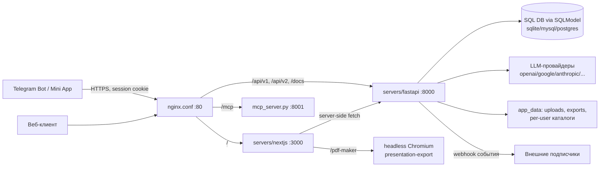

# Архитектура

Высокоуровневые границы компонентов и потоки данных. Детали реализации — в коде,
этот документ не пересказывает модули, а фиксирует границы, которые нельзя
нарушать без осознанного решения.

## Карта компонентов

## servers/fastapi (backend)

- `api/main.py`, `api/lifespan.py` — сборка приложения, lifespan (миграции,
  прогрев сервисов).
- `api/middlewares.py` — `SessionAuthMiddleware` (аутентификация по сессионной
  куке / внутренним заголовкам, выставляет owner-контекст) и
  `UserConfigEnvUpdateMiddleware`.
- `api/v1/` — роутеры по доменам:
  - `ppt/endpoints/` — основной домен презентаций: генерация (`generation.py`,
    `outlines.py`, `slide.py`), шаблоны, темы, иконки, изображения, файлы,
    LLM-провайдеры (`openai.py`, `anthropic.py`, `ollama.py`, ...).
  - `auth/` — bootstrap пользователей, OAuth (presenton cloud), principal,
    rate limit. Сюда же добавится `POST /api/v1/auth/telegram` (см. ниже).
  - `async_tasks/` — статус асинхронных задач (`GET /api/v1/async-tasks/{id}`).
  - `webhook/` — подписки на события генерации.
  - `admin/`, `mock/` — административные эндпоинты и моки для разработки.
- `services/` — бизнес-логика: `database.py` (сессии + **глобальный
  owner-скоупинг**, см. ниже), `image_generation_service.py`,
  `documents_loader.py`, `office_document_service.py`, `export_task_service.py`,
  `webhook_service.py`, `provider_settings.py` и др.
- `models/` — pydantic-схемы (`models/`) и SQLModel-таблицы (`models/sql/`).
- `templates/` — декларативные JSON-шаблоны презентаций (general, modern,
  standard, swift, dynamic, editorial, executive, momentum).
- `alembic/` + `migrations.py` — миграции схемы БД. Схему не менять без
  миграции (инвариант AGENTS.md).
- `mcp_server.py` — отдельный MCP-сервер на :8001 (генерация через MCP-инструменты).

### Owner-скоупинг (ключевой инвариант)

`services/database.py` перехватывает запросы SQLAlchemy: текущий `owner_id`
берётся из контекста запроса (`api/v1/auth/context.py`, выставляется
`SessionAuthMiddleware`), и выборки/вставки по owner-моделям автоматически
ограничиваются текущим пользователем. Обход возможен только через
`execution_options(skip_owner_scope=...)` — системные операции. Любой новый
эндпоинт, работающий с пользовательскими данными, получает изоляцию «бесплатно»
— не пиши ручные фильтры по user_id и не обходи скоупинг без причины.

## servers/nextjs (frontend)

- `app/(presentation-generator)/` — основной продуктовый фронт: dashboard,
  outline, редактор презентации (`presentation/`), upload, template-preview.
- `app/(export)/` — лёгкие страницы для headless-рендера (pdf-maker).
- Редактор слайдов — тяжёлый: konva, tiptap, mermaid, recharts,
  `@babel/standalone`; расчёт на viewport ≥1280px (проверки `matchMedia`).
  Поэтому в Telegram Mini App редактор не переносится (см. tg.md).
- `app/api/*` — Next.js route handlers (прокси/агрегация: upload-image,
  template, export-presentation, user-config и т.п.).
- Экспорт в PDF: страница `/pdf-maker` рендерится в headless Chromium
  (пакет presentation-export, синкается `scripts/sync-presentation-export.cjs`),
  FastAPI дёргает его через `services/export_task_service.py`.

## Корень репозитория

- `scripts/` — template-конвертеры (`convert-template.mjs`,
  `convert-presentation-template.mjs` + их тесты через `node --test`),
  синк presentation-export, проверки метаданных пакета.
- `nginx.conf` — единая точка входа: `/` → nextjs, `/api/*` → fastapi,
  `/mcp` → mcp-сервер, `/_auth_check` → auth verify.
- `Dockerfile`, `Dockerfile.dev`, `docker-compose.yml` — all-in-one образ
  (nginx + nextjs + fastapi + mcp в одном контейнере).
- `Makefile` — harness-гейт (`make check` / `make check-full` / `make fix`).

> P12: каталог `electron/` (десктопная обёртка) удалён — проект web/Docker-only.

## Telegram-интеграция (по tg.md)

Telegram-часть (бот, Mini App) пишется другим разработчиком; наша зона —
API-контракты на стороне fastapi/nextjs:

- **Auth**: `POST /api/v1/auth/telegram` — принимает `init_data` (строка
  `window.Telegram.WebApp.initData` как есть), проверяет подпись, создаёт
  аккаунт при первом входе, возвращает сессионную куку. Пользователь вида
  `tg_<telegram_id>` дальше неотличим от веб-пользователя (та же кука, тот же
  owner-скоупинг). Реализовано (`api/v1/auth/telegram.py`, задача P2).
- **Async-генерация**: `POST /api/v1/ppt/presentation/generate/async` →
  `AsyncTaskModel` (`id`, `data.presentation_id`); статус —
  `GET /api/v1/async-tasks/{task_id}`. По завершении в `data` появляются
  `path` (файл) и `edit_path` (редактор).
- **Вебхуки**: `POST /api/v1/webhook/subscribe` (`url`, `secret`, `event`),
  события `presentation.generation.completed|failed`. Подписка привязана к
  пользователю; доставка с ретраями (`webhook_service.py`), но поллинг статуса
  остаётся страховкой.
- **Mini App**: отдельный лёгкий route в том же Next.js («форма → генерация →
  превью → файл»), ничего не импортирующий из редактора. Превью слайдов —
  серверный рендер в PNG (`api/v1/ppt/endpoints/slide_preview.py`, задача P3).
- Файлы экспорта лежат в `app_data/exports/users/<user_id>/...`, доступ по
  сессионной куке; бот скачивает файл сессией пользователя и шлёт документом.
