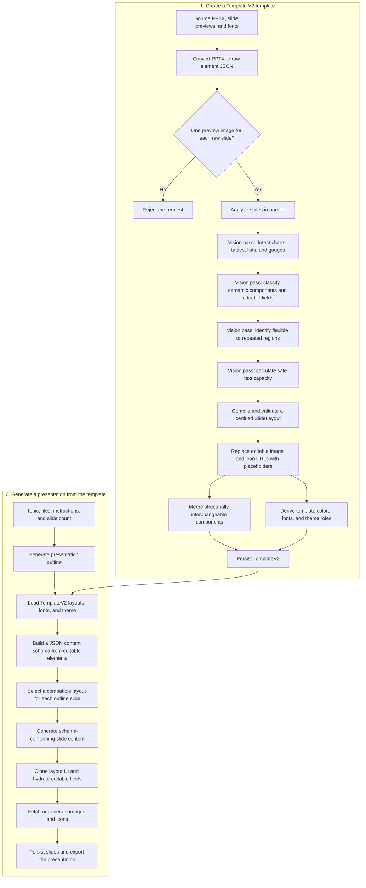

# Template V2: High-Level Architecture and Flow

Template V2 turns an existing PowerPoint deck into a set of reusable, editable
slide layouts. It preserves the source deck's visual design while identifying
which values can be replaced when Presenton generates a new presentation.

There are two separate workflows:

1. **Template creation** converts a source PPTX into certified Template V2
   layouts. This workflow requires a vision-capable language model.
2. **Presentation generation** selects those layouts, generates content that
   matches their JSON schemas, hydrates the layouts, and exports the deck.

## End-to-end flow

## Template creation

The creation API accepts a PPTX URL, rendered slide image URLs, optional font
mappings, and template metadata. Creation normally runs as an asynchronous task
so progress can be reported per slide.

### 1. Extract the source deck

The export service converts the PPTX into `RawSlideLayouts`. Raw layouts contain
the source elements, positions, sizes, styles, and assets. They provide exact
structure, while the rendered slide previews provide visual context that may be
missing or ambiguous in the PPTX representation.

Exactly one rendered preview image must be available for every processed raw
slide. If fewer previews are supplied, raw slides are capped to that count; if
there are more previews than raw slides, the request is rejected.

### 2. Certify each layout

Slides are processed in parallel, up to ten at a time. Each slide goes through
focused, schema-validated model passes:

- **Visual-data detection** recognizes supported charts, tables, text lists,
  progress bars, and gauges. A failed pass preserves the source region.
- **Semantic analysis** groups source elements into reusable components and
  marks content as editable or decorative. If this pass fails, creation uses a
  fidelity-preserving fallback layout.
- **Flexible-region analysis** identifies repeatable or flow-based content such
  as card grids and sequences. Failure leaves the semantic layout fixed.
- **Text-capacity analysis** calculates safe length and growth constraints for
  editable text. Failure keeps the previously validated geometry.
- **Compilation and certification** combines source elements with the model's
  decisions, validates the result, and retries with fewer optional decisions if
  needed.

Editable image and icon values are replaced with standard placeholders.
Decorative assets, such as backgrounds, logos, frames, and dividers, remain
fixed in the layout.

### 3. Build reusable template metadata

After every slide has a certified layout, two jobs run in parallel:

- Similar components are clustered and de-duplicated into reusable component
  variants.
- Colors and fonts are profiled and mapped to semantic theme roles. Theme role
  selection has a deterministic fallback.

The final `TemplateV2` record stores:

| Field | Purpose |
| --- | --- |
| `raw_layouts` | Faithful element JSON extracted from the source PPTX |
| `layouts` | Certified, reusable slide layouts |
| `merged_components` | Groups of structurally interchangeable components |
| `theme` | Semantic colors and typography derived from the layouts |
| `assets` | Source PPTX, preview images, fonts, icons, and image references |

## Presentation generation

Presentation generation does not re-analyze the source screenshots. It uses the
already certified Template V2 layout data:

1. Presenton generates or accepts the slide outlines.
2. The selected `TemplateV2` record is loaded with its layouts, fonts, and theme.
3. Every layout is converted into a JSON content schema. Only elements marked
   `decorative=false` become generated content fields.
4. A layout is selected for each outline based on the available layout
   descriptions and schemas.
5. The text model generates content conforming to the selected schema, including
   text, lists, tables, charts, image prompts, and icon queries.
6. The layout UI is deep-copied and the generated values are applied to its
   editable elements. Repeated groups are expanded or contracted within their
   certified limits.
7. Image and icon assets are fetched or generated, slides are saved, and the
   presentation is exported.

## Model requirements

| Capability | Requirement | Why it is needed |
| --- | --- | --- |
| Vision / image input | **Required for creating layouts from a PPTX** | The model receives each rendered slide screenshot together with the raw element JSON. A text-only model cannot perform the visual certification passes. |
| Structured JSON output | **Required** | Template analysis and slide content are validated against nested JSON schemas. |
| Output capacity | **16,000 output tokens recommended for template creation** | Template layouts can contain deeply nested components and element definitions. The creation pipeline requests up to 16,000 completion tokens. |
| Reliable instruction following | **Strongly recommended** | The model must preserve element indices, distinguish editable content from decoration, and respect geometry and content limits. |
| Tool calling | Optional for the main certified import flow | Some auxiliary layout-generation paths can render a candidate preview through the `previewSlide` tool, but imported-layout certification primarily uses structured responses. |
| Image generation model/provider | Optional and separate | It is used to create requested presentation imagery. It does not replace the vision-capable text model needed to analyze template screenshots. |

The configured **text model** is also the model used for Template V2 analysis.
Choose a model that accepts mixed image-and-text messages, such as GPT-4o,
Claude 3.5 Sonnet or newer, or a Gemini model with image support. The exact model
name depends on the configured provider.

> [!IMPORTANT]
> Configuring an image-generation model is not sufficient. Template creation
> sends slide screenshots to the text/LLM provider, so that text model itself
> must support vision.

A text-only model may still be sufficient for generating a presentation from an
already-created Template V2 template, because that path consumes layout JSON
rather than the original slide screenshots. It must still support the structured
JSON responses used for layout selection and content generation.

## Operational considerations

- Template creation can make several model calls per slide and processes up to
  ten slides concurrently. Provider rate limits should allow for this burst.
- Invalid structured responses are retried and validated before use.
- Layouts use a fixed 1280 x 720 coordinate system.
- Font mappings should be supplied when the source deck uses non-standard fonts;
  they are retained in the template and used during rendering and export.
- A source PPTX plus raw JSON is not enough for template creation. Rendered slide
  previews are required because appearance and semantic grouping depend on the
  actual pixels.

## Implementation map

- `servers/fastapi/api/v1/ppt/endpoints/template.py` — template APIs,
  asynchronous task orchestration, persistence, and retry handling.
- `servers/fastapi/templates/v2/certified_generation.py` — multi-pass vision
  analysis, validation, compilation, and fallbacks.
- `servers/fastapi/templates/v2/schema.py` — editable content schema generation.
- `servers/fastapi/templates/v2/theme.py` — color/font profiling and semantic
  theme generation.
- `servers/fastapi/api/v1/ppt/endpoints/presentation.py` — layout selection,
  content generation, hydration, asset processing, persistence, and export.
